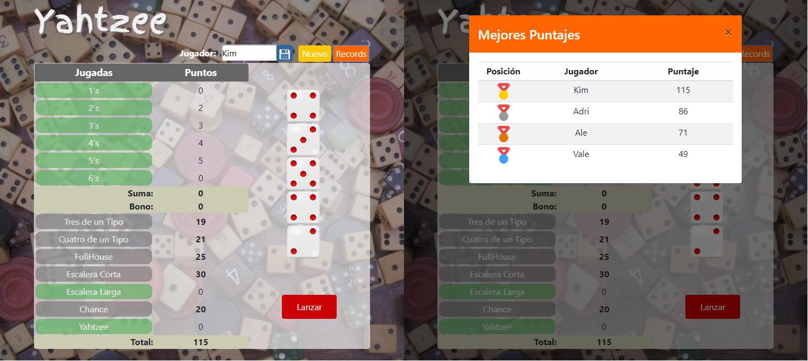

# Yahtzee
## I Proyecto de Fundamentos de Programación Web

#### Especificaciones:
* Lenguaje de programación: [PHP](http://www.php.net/) y CSS (Hoja de estilo)
* Base de datos: [MySQL](https://www.mysql.com/)
* Librerías: [Bootstrap](https://getbootstrap.com/) y [JQuery](https://jquery.com/)

#### Visualización del juego:

